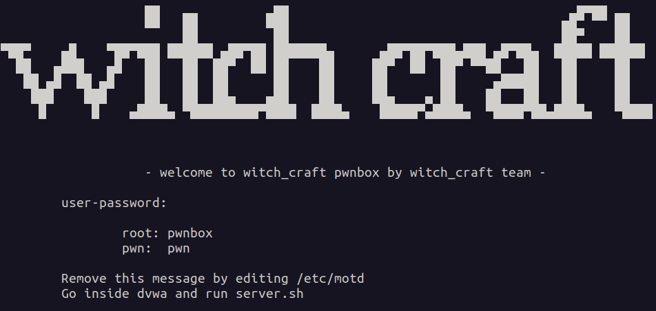

**WITCH_CRAFT** is a versatile task automation software designed to serve as the foundation for various cyber security modules. It provides capabilities for tasks such as forensic research, OSINT (Open Source Intelligence), scanning, backup and copying, intrusion testing of applications and APIs, and more.

The **WITCH_CRAFT_PWNBOX** is a series of virtual machines, each equipped with various tools for penetration testing and cybersecurity learning. One of these machines comes preloaded with Damn Vulnerable Web Application (DVWA) and Alpine Linux, providing a comprehensive environment for practicing web application security. Powered by nginx and Docker Compose, setup is streamlined for seamless deployment and efficient usage.

**user-password:**

	root: pwnbox
	pwn:  pwn

## Setup

**On Ubuntu/Debian:**

	sudo apt-get install virt-manager

**On CentOS/RHEL:**

    sudo yum install virt-manager

**Download the witch_craft_pwnbox_dvwa.qcow2 image:**

    You can obtain this image from a reliable source or provider.

**Open a terminal and run:**

        virt-manager

**Import the qcow2 image:**

	In virt-manager, click on "File" > "New Virtual Machine" to start the Virtual Machine creation wizard.
	Choose "Import existing disk image" and click "Forward".
    Browse and select the witch_craft_pwnbox_dvwa.qcow2 file.
    Follow the wizard to configure the virtual machine settings such as memory, CPU, and network.
    Complete the setup by clicking "Finish".
.
**Start the virtual machine:**

    Select the newly created virtual machine from the virt-manager interface.
    Click the "Play" button to start the virtual machine.

**Access the virtual machine:**

    Once the virtual machine is running, you can access it using a VNC viewer or the virt-manager console.

Please note that these are general instructions, and you may need to adjust them based on your specific setup or requirements. Additionally, ensure that you download the witch_craft_pwnbox_dvwa.qcow2 image from a trusted source to avoid security risks.